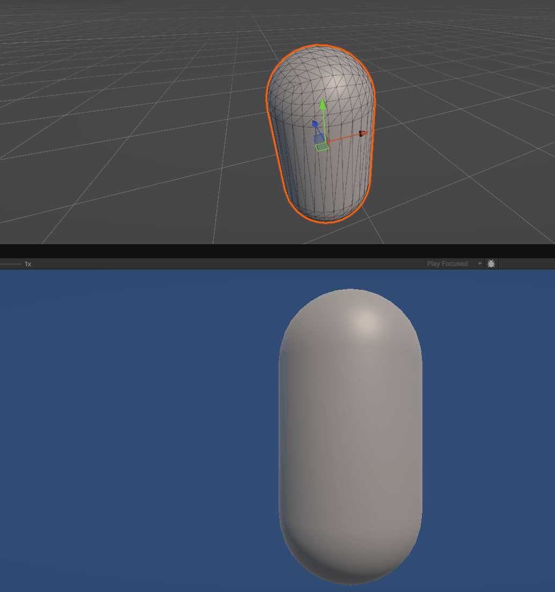

# meshcut

A demo project to learn to manipulate mesh data at runtime.

Fairly low allocations because I'm pooling most of my data structure instances.



## Basic steps:

1. Draw a plane which represents the cut
2. Inspect the tris of the mesh:
   - If a tri is completely on one side of the mesh, add it to that side's group
   - If a tri is split by the cutting plane, split it into 3 tris
3. Generate tris to fill in the gap caused by the cut

## Cool stuff:

Use an extension method to use System's ArrayPool like Unity ListPools

```cs
public readonly struct PooledArray<T> : IDisposable
{
    private readonly T[] array;
    private readonly ArrayPool<T> pool;

    public PooledArray(T[] array, ArrayPool<T> pool)
    {
        this.array = array;
        this.pool = pool;
    }

    public readonly void Dispose()
    {
        pool.Return(array);
    }
}

public static PooledArray<T> GetPooledSegment<T>(
    this ArrayPool<T> arrayPool,
    int length,
    out ArraySegment<T> segment
)
{
    var rentedArray = arrayPool.Rent(length);
    segment = new(rentedArray, 0, length);

    return new(rentedArray, arrayPool);
}

// Example
using var _s = ArrayPool<bool>.Shared.GetPooledSegment(3, out var sides);
```

Use a dictionary to sort points into 2 on one side and 1 on the other in one iteration

```cs
int smallerSign = 0;

// sorting vert data into pos/negative sides. so if 2 pos 1 neg, it will look like {-1: x, 1: y1, 2: y2}
for (int j = 0; j < 3; j++)
{
    int sign = sides[j] ? 1 : -1;
    VData vertData = triBuffer[j];

    if (!processingDict.TryAdd(sign, vertData))
    {
        smallerSign = sign * -1;
        processingDict[sign * 2] = vertData;
    }
}

// smaller sign will only have 1 entry, therefore that is X
x = processingDict[smallerSign];
y1 = processingDict[smallerSign * -1];
y2 = processingDict[smallerSign * -2];
```

Use a LinkedList to sort vertex pairs of potentially the wrong order so that they are linked

```cs
// e.g. [b,c, a,b, d,c, e,d] becomes [a,b,c,d,e]
// Example too long; see FillCutHole() in MeshCut.cs
```

Introducing more leeway to your data structures through Quantization and Approximation so that Vector properties with floating point inaccuracies are more usable in HashSets and Dictionaries

```cs
public static (int x, int y, int z) Quantize(Vector3 v)
{
    int x = Mathf.RoundToInt(v.x / Constants.FloatingPointTolerance);
    int y = Mathf.RoundToInt(v.y / Constants.FloatingPointTolerance);
    int z = Mathf.RoundToInt(v.z / Constants.FloatingPointTolerance);

    return (x, y, z);
}
```

```cs
public override int GetHashCode() =>
    HashCode.Combine(
        Helpers.Quantize(VertexPosition),
        Helpers.Quantize(UV),
        Helpers.Quantize(Normal)
    );
```

(For more examples see the VData class in MeshCut.cs)


Inspired by https://github.com/KristinLague/Mesh-Cutting